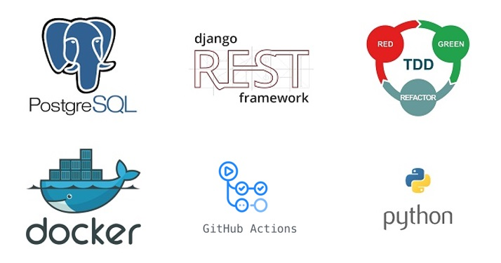
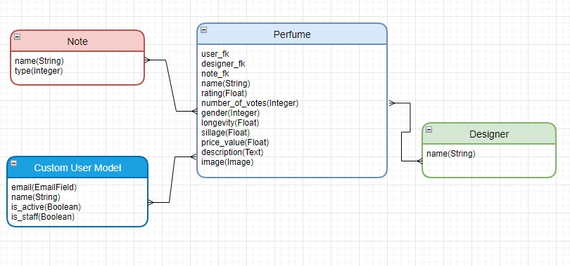

# Perfume API Backend Project

## Welcome to the Perfume API Backend Project!

This project is a powerful REST API built using Python, Django, Django REST Framework (DRF), Docker, GitHub Actions, Postgres and Test Driven Development (TDD) principles. It provides a sophisticated way to upload and store perfume information, including notes, designers, and photos.

The custom user model implemented in this project allows registration using only an email, making the API more secure and user-friendly. The API offers advanced features such as creating and updating user profiles, changing passwords, filtering and sorting objects, and uploading and viewing images.

## Technologies


## Features

* User authentication with custom user model allowing registration using email only
* Creating and updating user profiles
* Changing passwords
* Creating perfume objects
* Uploading and viewing images
* Filtering and sorting perfume objects by various attributes
* API documentation using DRF Spectacular and Swagger

## UML design



## Installation

To set up this project on your local machine, you will need Docker and Docker Compose installed. Once you have Docker and Docker Compose installed, run the following command:

```GitBash
docker-compose up -d --build
```


This will start the development server and Postgres database in separate Docker containers. You can then access the API at http://localhost:8000/api/v1/.

## Testing
This project follows best practice principles such as TDD, ensuring that all features are tested thoroughly before being released. To run the tests, use the following command:

```GitBash
docker-compose run app sh -c "python manage.py test && flake8"
```

This command will run the Django Test Framework and Flake8 code checks to ensure that the code is clean and adheres to PEP-8 standards.

## Continuous Integration
This project is configured to use GitHub Actions to automate linting and unit testing. When a pull request is created, GitHub Actions will automatically run the tests and code checks to ensure that the code is up to standard.

## Conclusion

This project leverages the power of Django REST Framework, DRF Spectacular, and Swagger to provide a seamless API experience for uploading and storing perfume information. The project's use of Test Driven Development ensures reliability and predictability in every code change. The integration of GitHub Actions further streamlines the development process, allowing for continuous integration and deployment. The use of Docker and Docker-Compose makes the project easy to set up and deploy to any environment, ensuring consistent behavior across different platforms. Finally, the project's custom user model and handling of media files demonstrates Django's capabilities and flexibility.